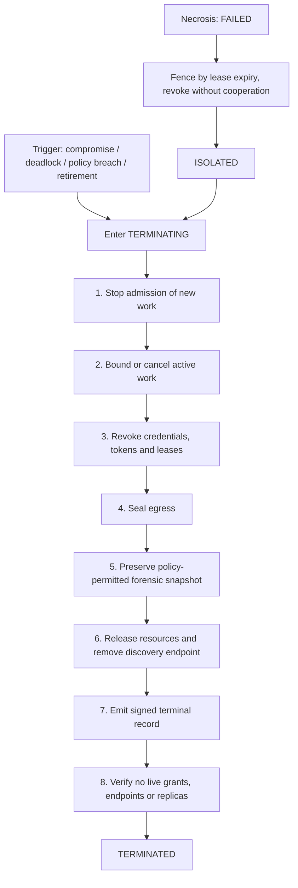

# Apoptosis Flow

```mermaid
flowchart TD
  T[Trigger: compromise / deadlock / policy breach / retirement] --> S[Enter TERMINATING]
  S --> A1[1. Stop admission of new work]
  A1 --> A2[2. Bound or cancel active work]
  A2 --> A3[3. Revoke credentials, tokens and leases]
  A3 --> A4[4. Seal egress]
  A4 --> A5[5. Preserve policy-permitted forensic snapshot]
  A5 --> A6[6. Release resources and remove discovery endpoint]
  A6 --> A7[7. Emit signed terminal record]
  A7 --> A8[8. Verify no live grants, endpoints or replicas]
  A8 --> D[TERMINATED]
  N[Necrosis: FAILED] --> F[Fence by lease expiry, revoke without cooperation] --> I[ISOLATED]
  I --> S
```

Шаги соответствуют `docs/LIFECYCLE.md`, раздел 4. Некроз не выполняет шаги 1–8 сам: недостающее принудительно выполняет внешний authority.
