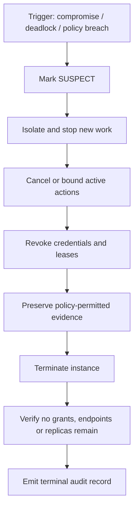

# Apoptosis Flow

```mermaid
flowchart TD
  T[Trigger: compromise / deadlock / policy breach] --> S[Mark SUSPECT]
  S --> I[Isolate and stop new work]
  I --> C[Cancel or bound active actions]
  C --> R[Revoke credentials and leases]
  R --> F[Preserve policy-permitted evidence]
  F --> X[Terminate instance]
  X --> V[Verify no grants, endpoints or replicas remain]
  V --> A[Emit terminal audit record]
```
