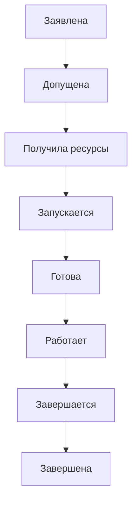
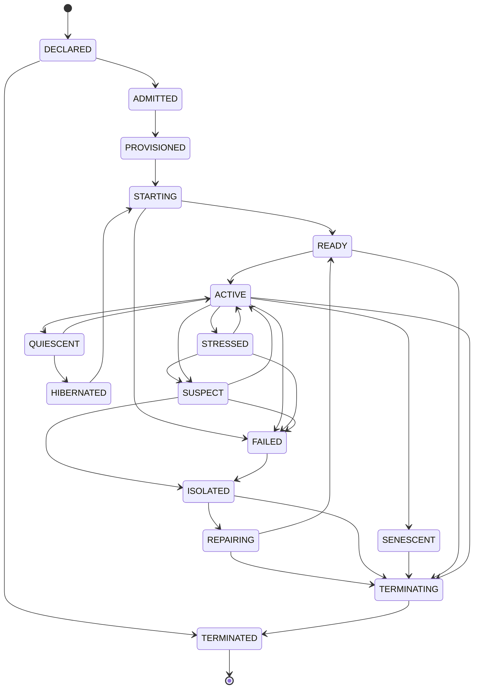

# Cell Lifecycle

## Простыми словами

Клетка — минимальная единица, которая выполняет работу (например, агент). Её допускают, запускают, и она работает. При подозрении клетку изолируют и ремонтируют, при сбое отключают. Завершение бывает двух видов: апоптоз (спокойное завершение по шагам) и некроз (аварийный отказ, после которого клетку принудительно отключают снаружи).

## Главный путь

**Если что-то пошло не так:** `ACTIVE` → `SUSPECT` (подозрение) → `ISOLATED` (изоляция) → `REPAIRING` (ремонт) → `READY`. Если клетка упала или потеряла право существовать (lease), она попадает в `FAILED`, затем в `ISOLATED`.

## Что значит каждое состояние

| Состояние | Что это значит |
|---|---|
| `DECLARED` | клетка заявлена, но ещё не допущена |
| `ADMITTED` | допущена: квота, подпись и лимит потомков в порядке |
| `PROVISIONED` | ресурсы зарезервированы, права выданы |
| `STARTING` | запускается |
| `READY` | запущена и прошла проверки готовности |
| `ACTIVE` | работает, право существовать (lease) действует |
| `STRESSED` | локальный стресс, клетка реагирует сама |
| `SUSPECT` | подозрение: аномалия или сомнение в целостности |
| `ISOLATED` | изолирована, трафик и права ограничены |
| `REPAIRING` | ремонт из доверенного независимого источника |
| `QUIESCENT` | приостановлена после завершения текущей работы |
| `HIBERNATED` | «спит»: долго простаивала |
| `SENESCENT` | состарилась, ждёт готовой замены |
| `FAILED` | аварийно упала или потеряла lease (некроз) |
| `TERMINATING` | идёт контролируемое завершение (апоптоз) |
| `TERMINATED` | завершена окончательно |

## Полная схема

Здесь показаны все переходы. Схема мелкая, она нужна для справки: условия каждого перехода (проверка, кто разрешает, срок) собраны в таблице в [docs/LIFECYCLE.md, раздел 4](../docs/LIFECYCLE.md).

Показать полную схему

Apoptosis = последовательность в состоянии `TERMINATING`; necrosis = путь через `FAILED` с обязательным fencing.

Источник истины: `specifications/state-machines.yaml` (машина `cell`); валидатор проверяет совпадение рёбер.
