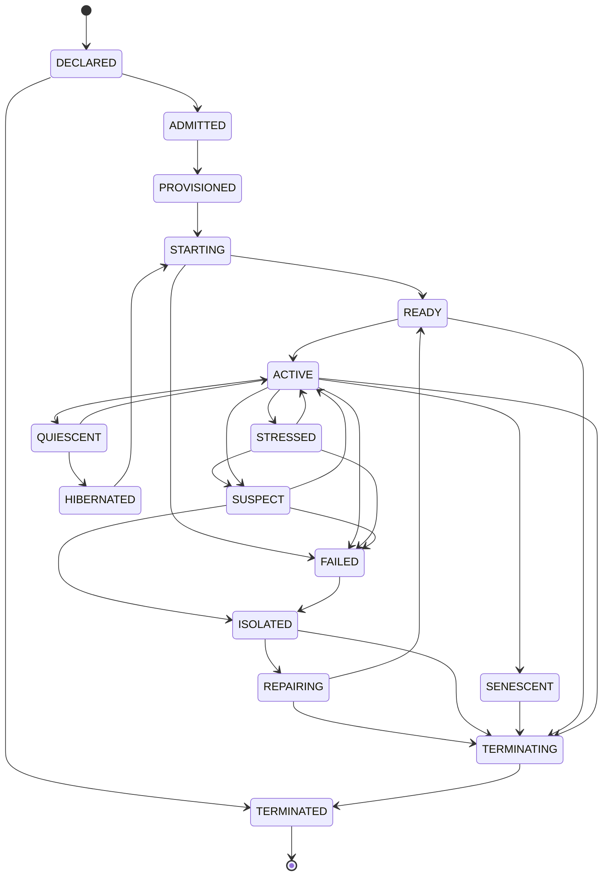

# Cell Lifecycle

Apoptosis = последовательность в состоянии `TERMINATING`; necrosis = путь через `FAILED` с обязательным fencing.

Источник истины: `specifications/state-machines.yaml` (машина `cell`); валидатор проверяет совпадение рёбер.
