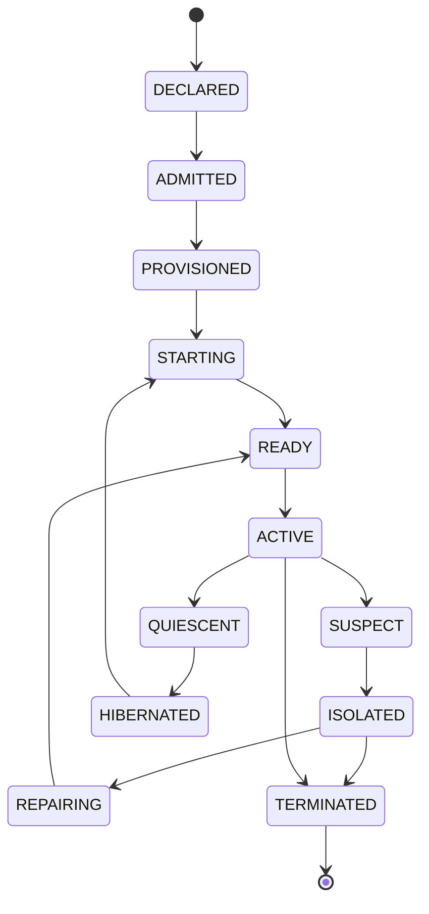

# Cell Lifecycle

```mermaid
stateDiagram-v2
  [*] --> DECLARED
  DECLARED --> ADMITTED
  ADMITTED --> PROVISIONED
  PROVISIONED --> STARTING
  STARTING --> READY
  READY --> ACTIVE
  ACTIVE --> SUSPECT
  SUSPECT --> ISOLATED
  ISOLATED --> REPAIRING
  REPAIRING --> READY
  ACTIVE --> QUIESCENT
  QUIESCENT --> HIBERNATED
  HIBERNATED --> STARTING
  ISOLATED --> TERMINATED
  ACTIVE --> TERMINATED
  TERMINATED --> [*]
```
