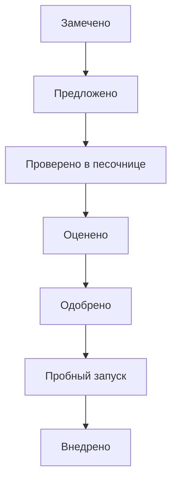
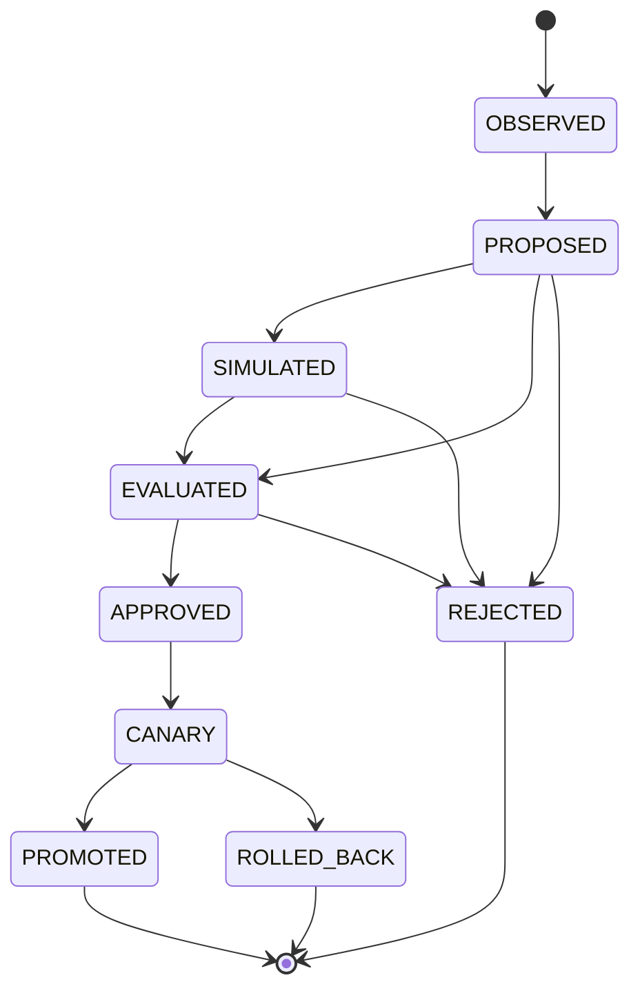

# Change Protocol

## Простыми словами

Любое изменение системы (обучение или изменение генома) проходит строгий путь: предложить, проверить, оценить, одобрить, пробно запустить на малой части (canary) и только потом внедрить. Если пробный запуск показал проблему, изменение откатывают. Тот, кто предлагает, не может сам проверять и одобрять.

## Главный путь

**Другие исходы:** `REJECTED` (отклонено на любом этапе до одобрения) и `ROLLED_BACK` (откат после неудачного пробного запуска). Обучение (`learning`) пропускает шаг `SIMULATED`, изменение генома (`evolution`) проходит все шаги.

## Что значит каждое состояние

| Состояние | Что это значит |
|---|---|
| `OBSERVED` | замечена потребность или возможность |
| `PROPOSED` | предложение подано в границах разрешённого |
| `SIMULATED` | проверено в песочнице без влияния на работу |
| `EVALUATED` | оценено по набору критериев, безопасность важнее выгоды |
| `APPROVED` | одобрено отдельным лицом или службой (authority), не автором и не оценщиком |
| `CANARY` | пробный запуск на малой части системы |
| `PROMOTED` | внедрено полностью |
| `ROLLED_BACK` | откат к предыдущей версии |
| `REJECTED` | отклонено |

## Полная схема

Здесь показаны все переходы. Схема мелкая, она нужна для справки: условия каждого перехода (проверка, кто разрешает, срок) собраны в таблице в [docs/LIFECYCLE.md, раздел 6](../docs/LIFECYCLE.md).

Показать полную схему

Learning (class=learning) пропускает `SIMULATED`; evolution (class=evolution) проходит все стадии. Terminal: `PROMOTED`, `ROLLED_BACK`, `REJECTED`.

Источник истины: `specifications/state-machines.yaml` (машина `change`); валидатор проверяет совпадение рёбер.
