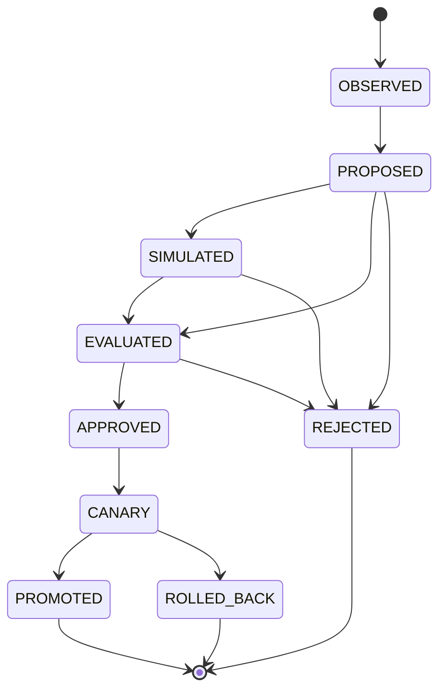

# Change Protocol

Learning (class=learning) пропускает `SIMULATED`; evolution (class=evolution) проходит все стадии. Terminal: `PROMOTED`, `ROLLED_BACK`, `REJECTED`.

Источник истины: `specifications/state-machines.yaml` (машина `change`); валидатор проверяет совпадение рёбер.
