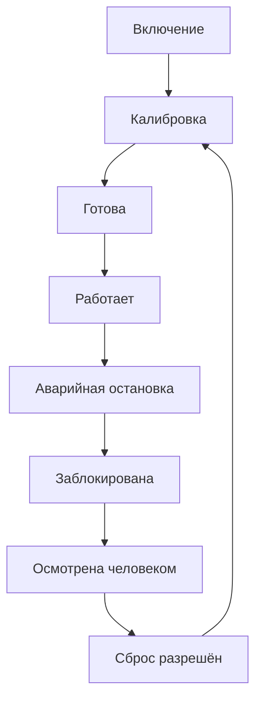
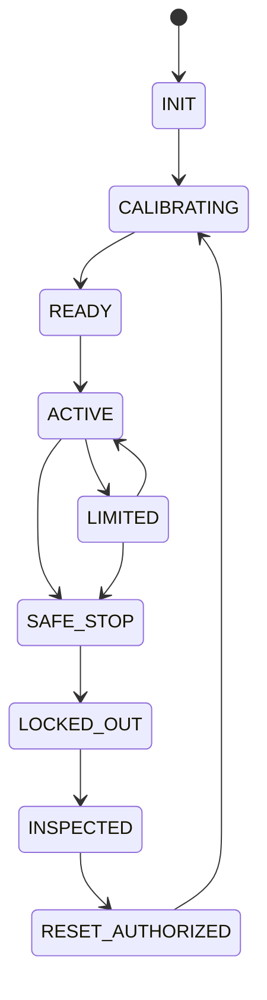

# Embodied Safety States

## Простыми словами

Состояния безопасности физической системы (робот, станок). Аварийная остановка срабатывает независимо от ИИ и от сети. После остановки систему блокируют, человек осматривает её и разрешает сброс, и только потом она калибруется и может работать снова.

## Главный путь

**Ограниченный режим:** при неопределённости, плохом датчике или близости (proximity) `ACTIVE` переходит в `LIMITED` и возвращается обратно, когда условие исчезло. Из `LIMITED` тоже возможна аварийная остановка.

## Что значит каждое состояние

| Состояние | Что это значит |
|---|---|
| `INIT` | включение, самопроверка оборудования |
| `CALIBRATING` | калибровка датчиков |
| `READY` | готова, задача ещё не разрешена |
| `ACTIVE` | работает штатно |
| `LIMITED` | ограниченный режим: неопределённость, плохой датчик или близость (proximity), в том числе человека |
| `SAFE_STOP` | аварийная остановка |
| `LOCKED_OUT` | заблокирована до осмотра |
| `INSPECTED` | человек осмотрел систему |
| `RESET_AUTHORIZED` | сброс разрешён, затем снова калибровка |

## Полная схема

Здесь показаны все переходы. Схема мелкая, она нужна для справки: условия каждого перехода (проверка, кто разрешает, срок) собраны в таблице в [docs/LIFECYCLE.md, раздел 10](../docs/LIFECYCLE.md).

Показать полную схему

Независимо от LLM и сетевого control plane. Подробности — `docs/ROBOTICS_EXTENSION.md`.

Источник истины: `specifications/state-machines.yaml` (машина `embodied_safety`); валидатор проверяет совпадение рёбер.
