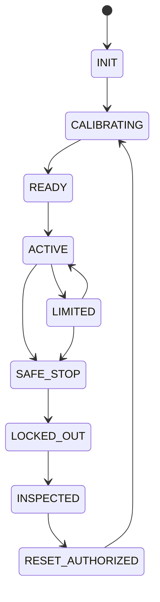

# Embodied Safety States

Независимо от LLM и сетевого control plane. Подробности — `docs/ROBOTICS_EXTENSION.md`.

Источник истины: `specifications/state-machines.yaml` (машина `embodied_safety`); валидатор проверяет совпадение рёбер.
