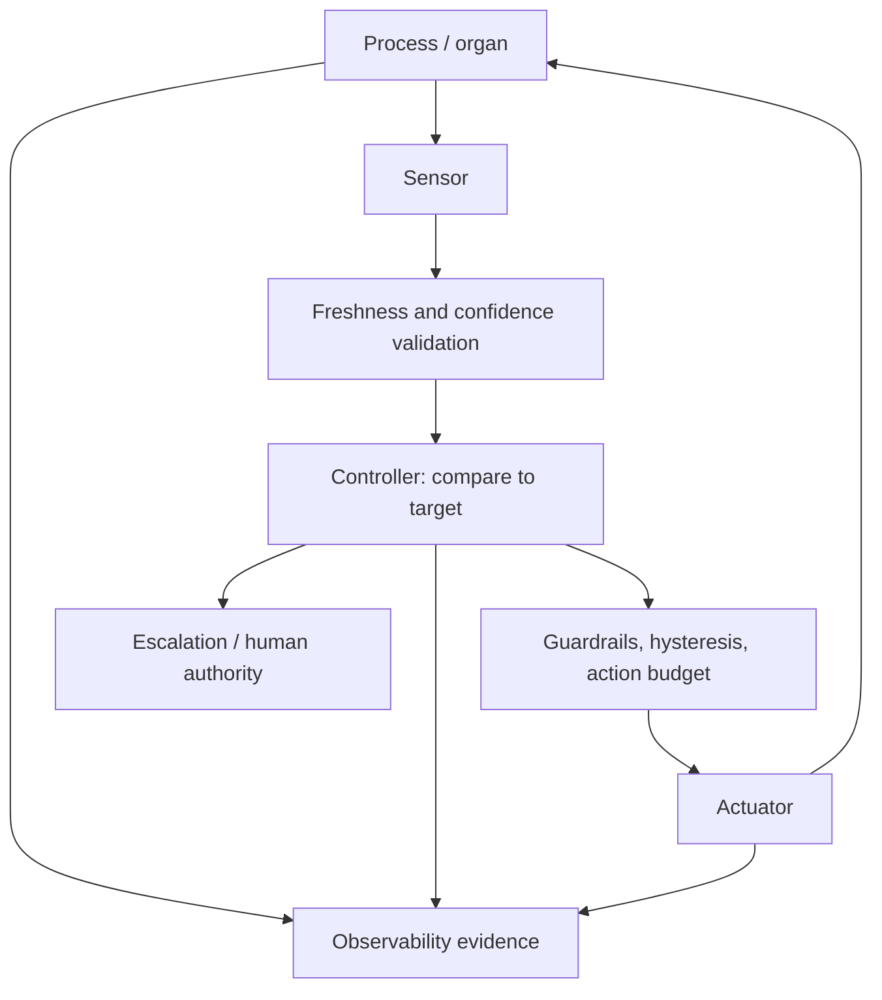

# Homeostasis Loop

## Простыми словами

Так система поддерживает себя в норме. Датчик измеряет показатель, проверка убеждается, что данные свежие и надёжные, контроллер сравнивает показатель с целью, ограничители (защитные пределы, запас против дёрганья туда-сюда и бюджет действий) не дают регулятору действовать слишком резко, исполнитель вносит поправку. Если контроллер не справляется, он зовёт человека. Всё происходящее записывается как доказательство.

## Схема

