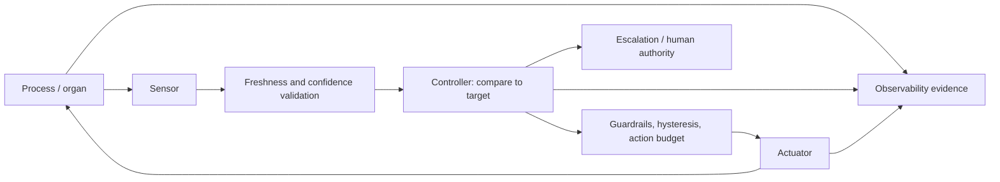

# Homeostasis Loop

```mermaid
flowchart LR
  P[Process / organ] --> S[Sensor]
  S --> V[Freshness and confidence validation]
  V --> C[Controller: compare to target]
  C --> G[Guardrails, hysteresis, action budget]
  G --> A[Actuator]
  A --> P
  C --> E[Escalation / human authority]
  P --> O[Observability evidence]
  C --> O
  A --> O
```
