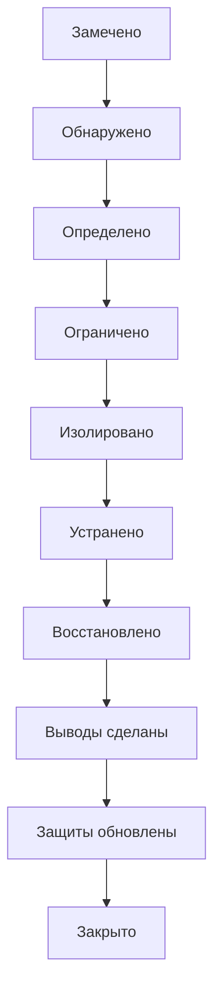
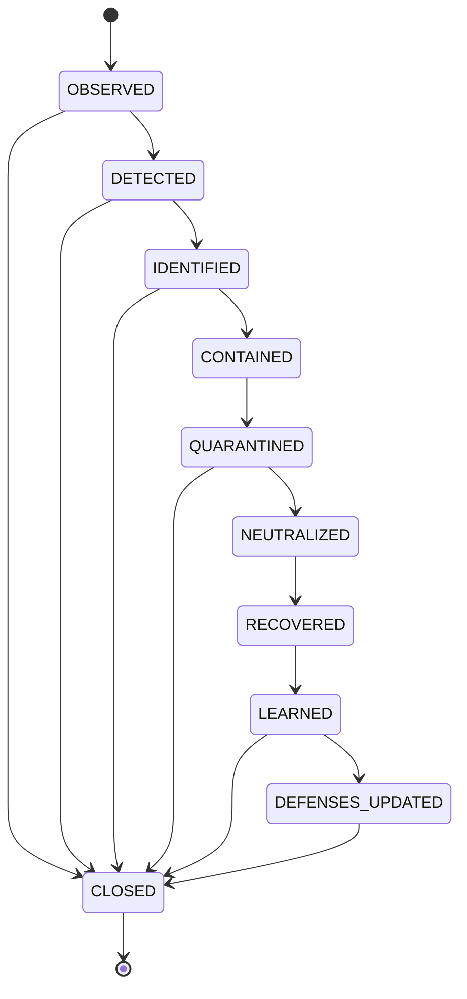

# Immune Response

## Простыми словами

Так система реагирует на угрозу безопасности: заметила, определила, что это, ограничила распространение, изолировала, устранила, восстановилась, сделала выводы и обновила защиты. Изоляция работает без согласия нарушителя. На многих шагах дело можно закрыть как ложную тревогу.

## Главный путь

**Ложная тревога:** из шагов `OBSERVED`, `DETECTED`, `IDENTIFIED`, `QUARANTINED` дело можно сразу закрыть (`CLOSED`) с записанной причиной. После `LEARNED` защиты можно не менять, если это не нужно.

## Что значит каждое состояние

| Состояние | Что это значит |
|---|---|
| `OBSERVED` | замечено что-то подозрительное |
| `DETECTED` | сработало правило или порог |
| `IDENTIFIED` | событие разобрано и классифицировано |
| `CONTAINED` | применено ограничение на срок (TTL) |
| `QUARANTINED` | объект изолирован, доказательства сохранены |
| `NEUTRALIZED` | угроза удалена, объект завершён или его доступ отозван |
| `RECOVERED` | восстановление проверено по доверенному источнику |
| `LEARNED` | разбор инцидента записан |
| `DEFENSES_UPDATED` | новое правило проверено и внедрено |
| `CLOSED` | дело закрыто, в том числе как ложная тревога |

## Полная схема

Здесь показаны все переходы. Схема мелкая, она нужна для справки: условия каждого перехода (проверка, кто разрешает, срок) собраны в таблице в [docs/LIFECYCLE.md, раздел 5](../docs/LIFECYCLE.md).

Показать полную схему

detect → identify → contain → quarantine → neutralize → recover → learn → update defenses.

Источник истины: `specifications/state-machines.yaml` (машина `incident`); валидатор проверяет совпадение рёбер.
