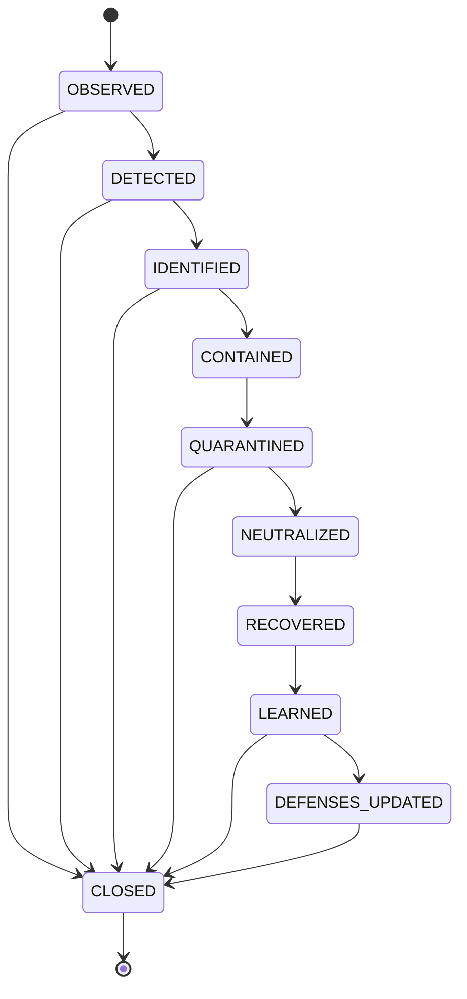

# Immune Response

detect → identify → contain → quarantine → neutralize → recover → learn → update defenses.

Источник истины: `specifications/state-machines.yaml` (машина `incident`); валидатор проверяет совпадение рёбер.
