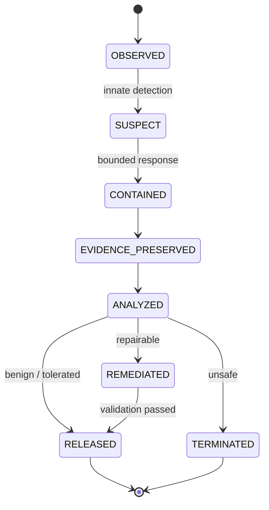

# Immune Response

```mermaid
stateDiagram-v2
  [*] --> OBSERVED
  OBSERVED --> SUSPECT: innate detection
  SUSPECT --> CONTAINED: bounded response
  CONTAINED --> EVIDENCE_PRESERVED
  EVIDENCE_PRESERVED --> ANALYZED
  ANALYZED --> RELEASED: benign / tolerated
  ANALYZED --> REMEDIATED: repairable
  ANALYZED --> TERMINATED: unsafe
  REMEDIATED --> RELEASED: validation passed
  RELEASED --> [*]
  TERMINATED --> [*]
```
