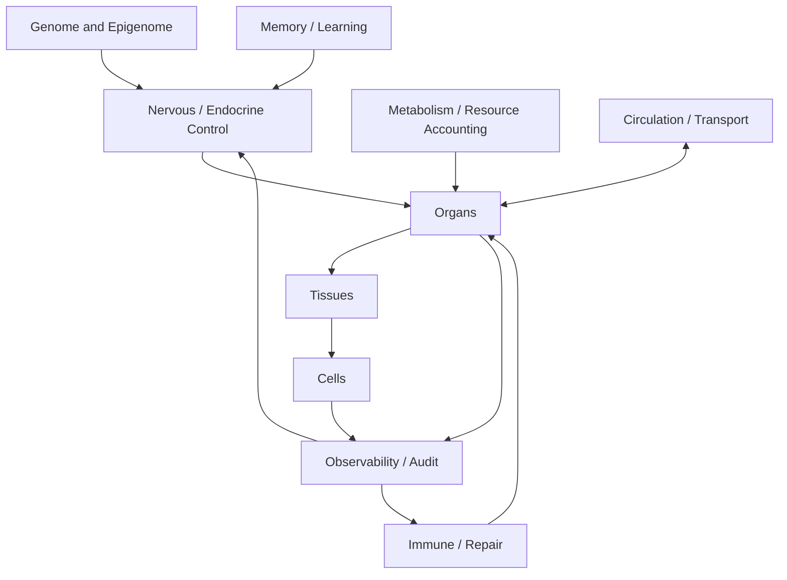

# Organism Layers

```mermaid
flowchart TB
  G[Genome and Epigenome]
  C[Nervous / Endocrine Control]
  I[Immune / Repair]
  M[Memory / Learning]
  R[Metabolism / Resource Accounting]
  T[Circulation / Transport]
  O[Organs]
  TI[Tissues]
  CE[Cells]
  OBS[Observability / Audit]
  G --> C
  C --> O
  I --> O
  M --> C
  R --> O
  T <--> O
  O --> TI --> CE
  CE --> OBS
  O --> OBS
  OBS --> C
  OBS --> I
```
