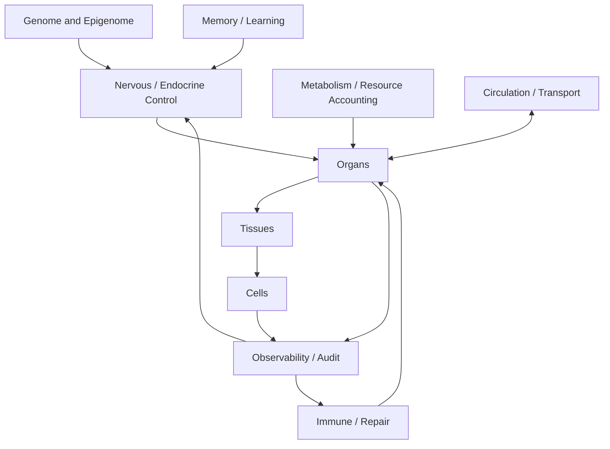

# Organism Layers

## Простыми словами

Организм состоит из слоёв. Геном задаёт правила. Нервная и эндокринная системы управляют. Иммунитет и ремонт защищают. Память учится на опыте. Обмен веществ считает ресурсы. Циркуляция переносит сообщения. Органы, ткани и клетки выполняют работу. Наблюдаемость (observability) видит всё происходящее и возвращает сигналы управлению и иммунитету.

## Схема

