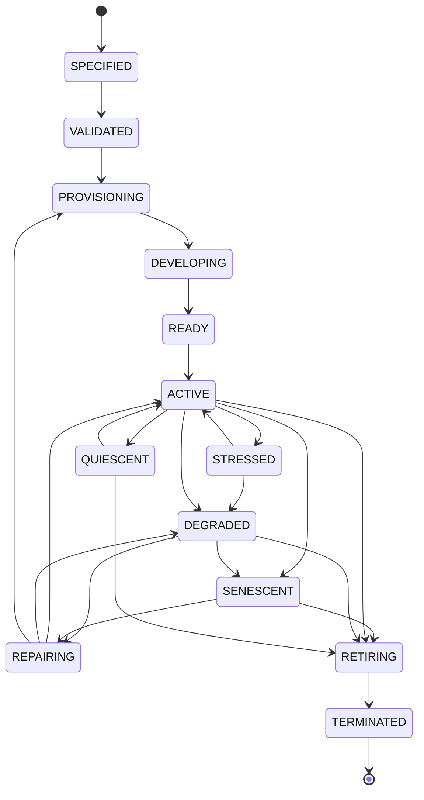

# Organism Lifecycle

Birth → Development → Maturity → Aging → Termination. `QUARANTINED` is an orthogonal security state (см. `LIFECYCLE.md`).

Источник истины: `specifications/state-machines.yaml` (машина `organism`); валидатор проверяет совпадение рёбер.
