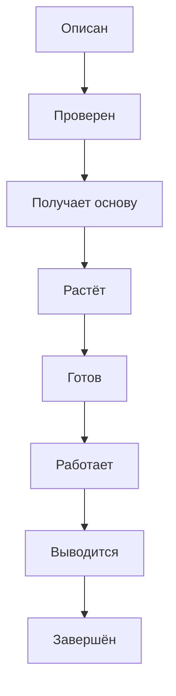
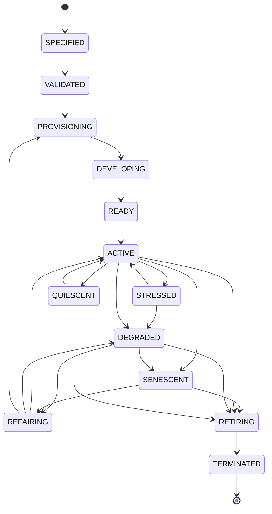

# Organism Lifecycle

## Простыми словами

Организм (вся ИИ-система целиком) проходит путь жизни: его описывают, проверяют, запускают, он работает, стареет и в конце безопасно завершается. Во время работы он может «заболеть» (стресс, потеря функций) и вылечиться. Каждый переход разрешён только при выполнении условия (проверки перед переходом), и о каждом переходе остаётся запись в журнале.

## Главный путь

**Если что-то пошло не так:** `ACTIVE` → `STRESSED` (показатель вышел из нормы) → `DEGRADED` (потеря функций) → `REPAIRING` (ремонт) → снова `ACTIVE`. Если ремонт невыгоден, организм старится (`SENESCENT`) и его заменяют или выводят из эксплуатации.

## Что значит каждое состояние

| Состояние | Что это значит |
|---|---|
| `SPECIFIED` | описан (геном написан), но ещё не проверен |
| `VALIDATED` | геном прошёл проверку схемы и подписи |
| `PROVISIONING` | готовится основа: выдаются инфраструктура и идентичность |
| `DEVELOPING` | организм «растёт»: проходит контрольные точки развития |
| `READY` | готов к работе, проверки пройдены |
| `ACTIVE` | нормальная работа |
| `STRESSED` | показатель вышел за допустимый диапазон, идёт регулирование |
| `DEGRADED` | работает с потерями: потерян критический орган или стресс затянулся |
| `REPAIRING` | идёт восстановление по доверенному плану |
| `QUIESCENT` | плановая пауза: обслуживание или просьба оператора |
| `SENESCENT` | состарился: работает с ограничениями и ждёт замены |
| `RETIRING` | выводится из эксплуатации: решение принято, права отзываются |
| `TERMINATED` | завершён окончательно: права отозваны, журнал запечатан, выдана запись о завершении (tombstone), которая запрещает воскрешение |

## Полная схема

Здесь показаны все переходы. Схема мелкая, она нужна для справки: условия каждого перехода (проверка, кто разрешает, срок) собраны в таблице в [docs/LIFECYCLE.md, раздел 3](../docs/LIFECYCLE.md).

Показать полную схему

Birth → Development → Maturity → Aging → Termination. `QUARANTINED` is an orthogonal security state (см. `LIFECYCLE.md`).

Источник истины: `specifications/state-machines.yaml` (машина `organism`); валидатор проверяет совпадение рёбер.
