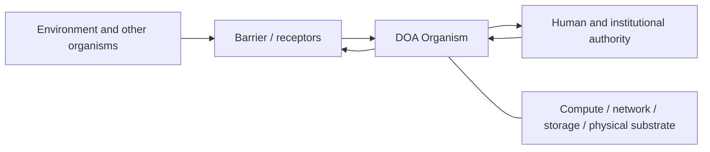

# System Context

```mermaid
flowchart LR
  ENV[Environment and other organisms] --> B[Barrier / receptors]
  B --> O[DOA Organism]
  O --> B
  O --> GOV[Human and institutional authority]
  GOV --> O
  O --- INFRA[Compute / network / storage / physical substrate]
```

Environment data is untrusted by default. Governance defines authority; infrastructure provides substrate but does not become the organism's policy owner.
