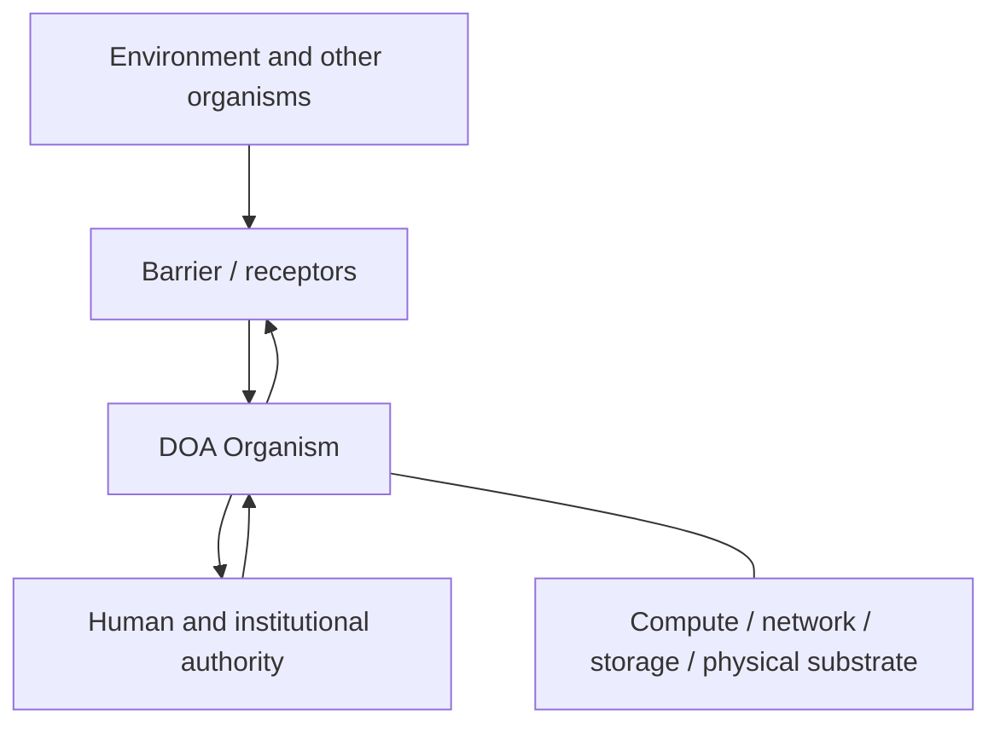

# System Context

## Простыми словами

Организм не живёт в пустоте. Снаружи на него действуют среда и другие организмы, их данные по умолчанию не заслуживают доверия, поэтому всё входящее проходит через барьер. Права и решения задают люди и организации. Инфраструктура даёт вычисления, сеть и хранилище, но не получает власти над правилами организма.

## Схема

Environment data is untrusted by default. Governance defines authority; infrastructure provides substrate but does not become the organism's policy owner.
